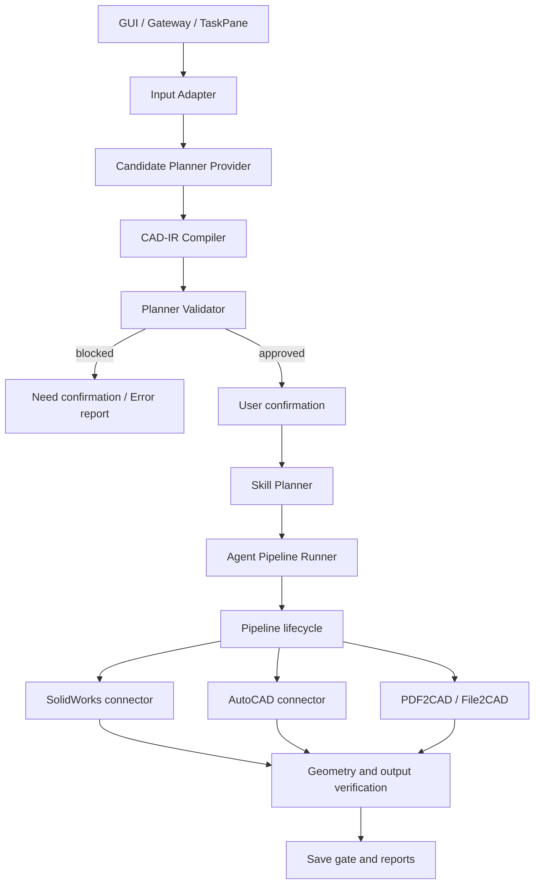

# PartLoom 架构说明

## 设计目标

PartLoom 将“理解需求”和“修改 CAD 文档”隔离。模型 Provider 可以犯错，
但它的错误不能直接变成 SolidWorks 或 AutoCAD 副作用。

核心不变量：

1. LLM 只生成候选计划，不能直接调用 CAD API；
2. 所有生产任务都必须通过标准 CAD-IR；
3. Planner 和 Pipeline 两侧都执行确定性门禁；
4. Router 只能选择 `allowed_skills` 内的能力；
5. Pipeline 只能发布 `expected_outputs` 内的文件；
6. required Feature 失败时立即停止，不伪造后续成功；
7. 保存前必须经过模型完整性与范围校验；
8. 用户未明确要求完整流程时，默认执行最小阶段。

## 总体数据流



Direct CAD-IR 模式会跳过候选 LLM 规划，但不会跳过 CAD-IR Compiler、
Planner Validator、用户确认、Pipeline 和保存门禁。

## 模块职责

### 输入层

- `app.py`：PySide6 桌面工作台；
- `cad_agent.direct_cad_ir`：读取一个 CAD-IR JSON 对象或文件路径；
- `cad_agent.gateway`：localhost HTTP API、任务状态和事件流；
- `SolidWorksCadAgentAddin`：实验性 SolidWorks TaskPane 客户端。

输入层不应包含 SolidWorks FeatureManager 调用。

### 规划与校验层

- `provider_registry.py`：Provider 统一配置；
- `candidate_planning_service.py`：请求模型生成候选计划；
- `cad_ir.py`：canonical operation、参数别名、单位、冲突与依赖；
- `planner_validator.py`：检查 assumptions、unresolved、置信度和目标引用；
- `stage_planner.py`：识别 model/drawing/annotation/export 阶段；
- `skill_planner.py`：根据 CAD-IR 和 Registry 生成有序 Skill 步骤。

校验失败只能返回结构化错误，不能启动 CAD。

### Registry 与几何上下文

- `feature_reference_registry/`：注册 Skill 输入输出、Feature Tree、语义角色
  和可持久化引用；
- `geometry_resolver/`：从候选 Face 中确定满足语义角色的几何，并建立
  O/U/V/N 局部坐标系；
- `geometry_context.py`：在执行步骤之间携带 Body、Feature、Face、Axis
  和局部方向；
- `model_integrity.py`：验证 Body 数量、体积、包围盒、必要 Feature 和重建
  错误。

语义引用示例：

```json
{
  "resolution": "semantic_reference",
  "body_ref": "primary_solid",
  "feature_ref": "base",
  "face_role": "outer_horizontal_face"
}
```

它比 `face="top"` 更稳定，但仍需要真实 CAD 几何验收。

### Pipeline

- `agent_pipeline_runner.py`：创建任务上下文、报告和输出目录；
- `pipeline_executor.py`：执行 Skill 生命周期和阶段停止规则；
- `cad_execution_lock.py`：防止多个 CAD 任务并发修改交互式会话；
- `pipeline_context.py`：任务状态、输出、错误和引用上下文；
- `pipeline_logger.py`：结构化生命周期日志；
- `pipeline_report.py`：统一 JSON 报告。

统一生命周期：

```text
prepare -> execute -> verify -> export -> cleanup
```

`execute` 返回不等于几何成功。`verify` 和保存门禁必须确认真实结果。

### CAD 连接器与执行器

- `sw_connector.py`：SolidWorks COM 会话、文档和基础 API 适配；
- `*_skill.py`：按 operation 拆分的生产执行器；
- `solidworks_complex_drawing.py`：复杂视图与工程图路径；
- `autocad_annotation_engine.py`：DWG 实体分析、尺寸策略和布局；
- `pdf2cad/`：PDF/MinerU/OCR 输出到 Drawing IR；
- `file2cad/` 与 `dwg2cad_ir.py`：文件类型和二维 CAD 输入路由。

连接器不得自行扩大执行阶段，也不得顺手导出未请求格式。

## 阶段模型

| 阶段 | 典型操作 | 默认停止点 |
|---|---|---|
| `model_3d` | Part Feature 与 SLDPRT 保存 | `model_3d` |
| `drawing` | 视图、布局、尺寸和 SLDDRW | `drawing` |
| `autocad_annotation` | DWG 打开、原生标注和 Annotated DWG | `annotation` |
| `export_files` | STEP、PDF、DWG、DXF、STL 等明确输出 | `export` |
| `full_pipeline` | 用户明确要求的完整阶段集合 | `export` |

只有明确要求“完整生成”时才允许 `full_pipeline`。

## 报告与产物

一个任务通常包含：

```text
task_directory/
├── brain_plan.json
├── design_plan.json
├── pipeline_report.json
├── annotation_report.json       # 仅标注阶段
├── model/                       # CAD 中间文件
└── exported outputs             # 仅用户明确请求
```

`pipeline_report.json` 记录开始/结束时间、每个步骤状态、输入参数、输出路径、
失败原因、日志位置和 Recovery 建议。

## 扩展新 operation

新增能力不应只增加一个函数入口。至少需要：

1. 在 CAD-IR 中声明 canonical operation 与参数契约；
2. 增加别名、单位、必填参数、冲突和上下文规则；
3. 在 Skill Registry 声明 capability、side effects 和 output types；
4. 在 Skill Planner 中加入阶段和依赖路由；
5. 实现 `prepare/execute/verify/export/cleanup`；
6. 注册产生和消费的 Body/Feature/Face/Axis 引用；
7. 增加几何预检与结果验证；
8. 增加合成单元测试和组合回归；
9. 更新 `CAPABILITIES.md`；
10. 在隔离的真实 CAD 环境保存、关闭、重开并验证。

## 安全边界

- Gateway 只允许 localhost；
- API Key 只从本机环境或未跟踪的 `.env.local` 读取；
- 公共测试不得包含客户 CAD；
- 发布审计会阻止密钥、个人路径、日志、图片和 CAD 输出；
- 云端 CI 不启动有许可证的 CAD；
- 执行前应保存用户工作并关闭模态弹窗；
- Beta 产物必须经过人工工程审查。
